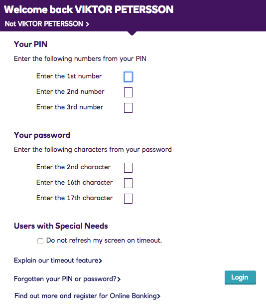

# NatPass
NatPass is a password assistance tool that helps dealing with NatWest's annoying password system.

# Requirement

* macOS (or any other platform supported by 1Password's CLI and has Bash)
* 1Password 
  * An entry in 1Password that holds your NatWest password (default 'Natwest')
  * An entry in 1Password that holds your NatWest online PIN (default 'Natwest PIN')
* A NatWest account (d'oh!)
* 1Password's CLI (`brew cask install 1password-cli`)
* jq

# Usage

Whenever you log into NatWest, you're prompted with a dialogue like this:



Well, if you're a modern human being, you're most likely using a password management tool (such as 1Password). This login page is far from compatible with modern password practices.

To solve this, I whipped up a Python tool that to simplify this. Enter NatPass.

```
$ export OP_ORG=someorg ./natpass.sh 
Enter the requested requested PIN numbers (e.g. 1 2 3) and press [ENTER]: 1 2 3
Enter the requested requested password characters (e.g. 1 2 3) and press [ENTER]: 1 2 3
Enter the password for hello@example at someorg.1password.com:
1
4
6
The requested password items are as follows:
a
B
C
```

# Installation

* Install 1Password's CLI and follow the [Gettings Started Guide](https://support.1password.com/command-line-getting-started/)
* Install `jq` 

To override the default entries ('Natwest' and 'Natwest PIN'), you can export the environment variables 'NATWEST_LOGIN_ITEM' and 'NATWEST_PIN_ITEM'.

